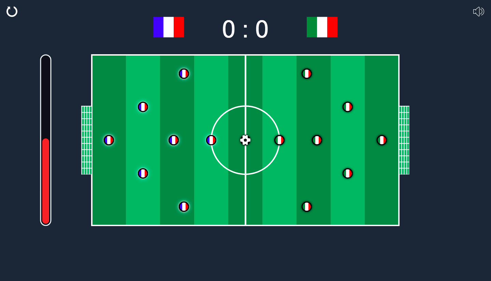

# HTML5 FootballGame

A HTML 5 football game inspired by [Soccer Stars by MiniClip](https://www.miniclip.com/games/soccer-stars-mobile/fr/)



## Running

* Run ``` webpack ```
* Open ``` index.html ```

## Rules
* One shoot by turn
* A goal is scored when a ball enter in a goal

## Features

* Change the colors of each players by clicking the flags
* Change the shooting power by adjusting the gage on the left
* Colors are saved in cookies
* Can restart all the game
* Can enabled and disable the sound

## Author

* **Adrien Audouard** - [RidazFluent](https://github.com/RidazFluent)

## Licence

This project is licensed, see the [LICENSE.md](LICENSE.md) file for details
